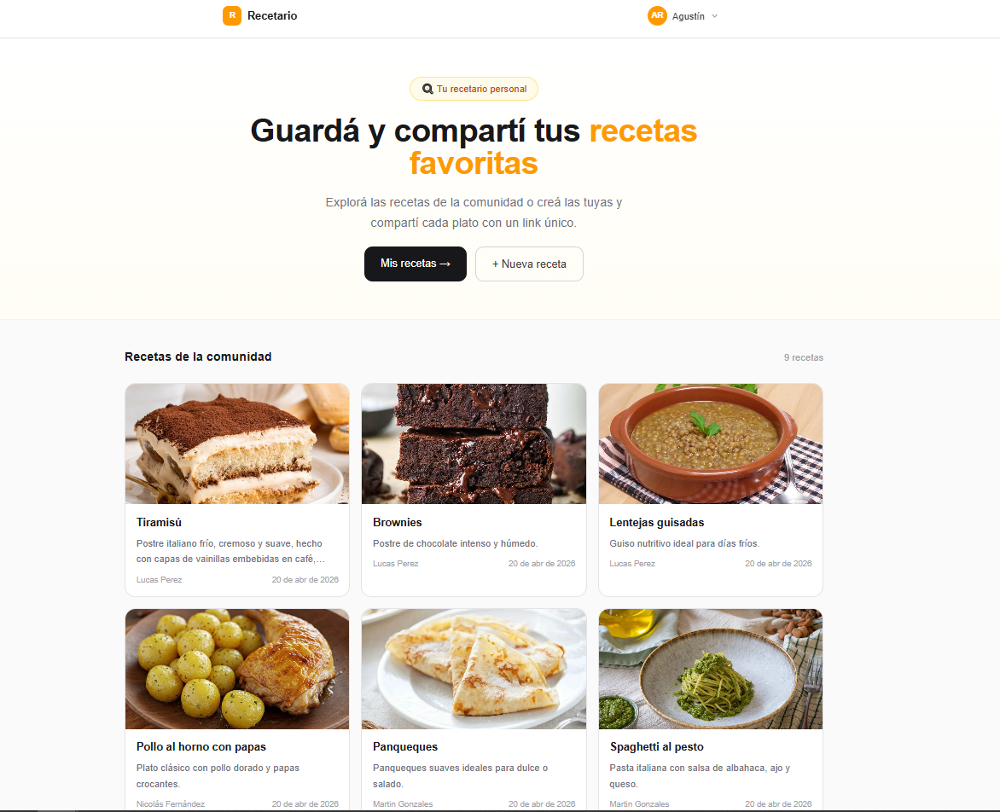
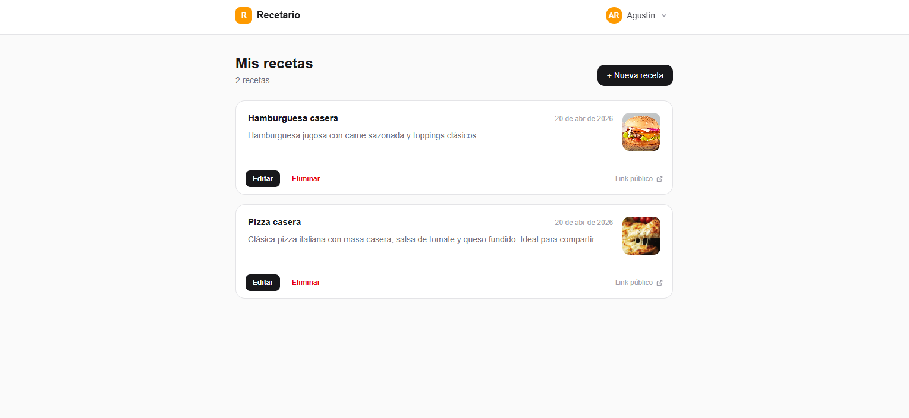
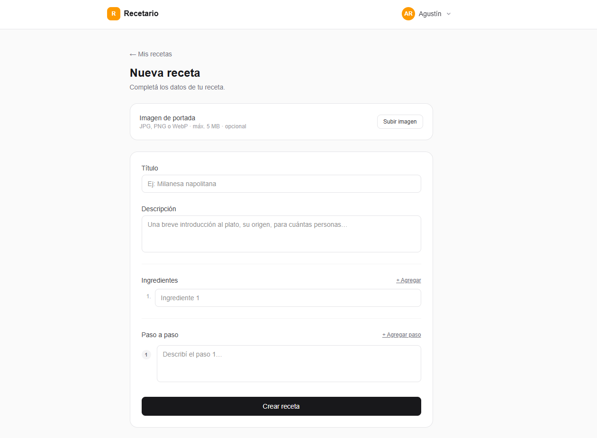
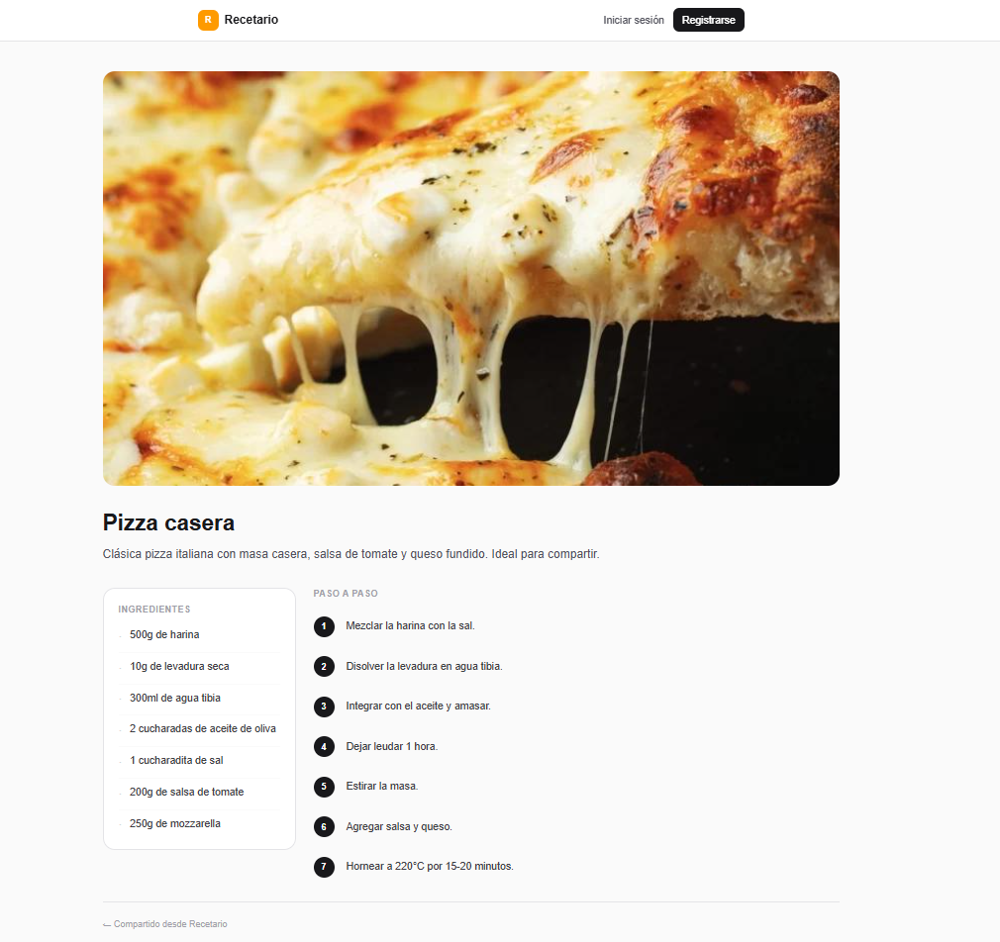

# Recetario

Aplicación fullstack de recetas construida como challenge técnico. Los usuarios pueden registrarse, crear y gestionar recetas, y compartirlas con un link público sin necesidad de cuenta.

**Demo en vivo →** https://recipe-app-fullstack-three.vercel.app

> Podés registrarte con cualquier email para probar la app completa.

---

## Preview






---

## Stack

| Capa | Tecnología |
|---|---|
| Backend | Node.js + NestJS 11 |
| ORM | Prisma 7 + PostgreSQL |
| Frontend | Next.js 16 (App Router) + React 19 |
| Formularios | React Hook Form 7 + Zod 4 |
| Auth | JWT en cookie httpOnly |
| Hash de contraseñas | Argon2id |
| Estilos | Tailwind CSS 4 |
| Imágenes | Cloudinary |
| Base de datos (prod) | Supabase (PostgreSQL) |

---

## Funcionalidades

- Registro e inicio de sesión con cookie `httpOnly` (sin localStorage)
- CRUD completo de recetas: título, descripción, ingredientes y pasos ordenados
- Subida de imagen de portada por receta
- Link público por receta, accesible sin autenticación
- Feed público de recetas en la home
- Eliminación con confirmación
- Rutas privadas con redirección automática post-login

---

## Arquitectura

### Backend — Clean Architecture

```
Domain         →  interfaces y tipos puros (sin frameworks)
Application    →  lógica de negocio (servicios inyectables)
Infrastructure →  controllers HTTP, repositorios Prisma, schemas Zod
```

La lógica de negocio no depende de Prisma ni de NestJS. Cambiar el ORM solo afecta la capa de infraestructura.

### Frontend — Feature-based

```
src/features/   →  auth, recipes (cada feature aislada)
src/lib/api/    →  cliente HTTP centralizado (apiJson, apiUpload)
src/components/ →  nav, footer (componentes globales)
```

Auth global via React Context. Sesión inicializada desde `/auth/me` al cargar la app.

---

## Decisiones técnicas

| Decisión | Motivo |
|---|---|
| Cookie `httpOnly` para JWT | Previene robo de token por XSS |
| Argon2id para contraseñas | Memory-hard, resistente a ataques GPU |
| `publicId` separado del UUID interno | El ID interno nunca se expone en URLs públicas |
| Estrategia full-replace en ingredientes/pasos | Simplicidad sin lógica de diff |
| `memoryStorage` + Cloudinary | Filesystem efímero en Railway — las imágenes en disco no sobreviven redeploys |
| `sameSite: none` en producción | Necesario para cookies cross-origin entre Vercel y Railway |

---

## Validaciones

**Backend** — schemas Zod en cada endpoint, mensajes de error claros, ownership check en toda operación de escritura (404 si no existe, 403 si no es el dueño), solo `image/*` aceptado en upload (máx 5 MB).

**Frontend** — React Hook Form + Zod con mensajes en español, redirect post-login validado (debe empezar con `/`, sin `://`).

---

## Tests

Tests unitarios sobre los servicios de aplicación. Sin base de datos — todo mockeado con `jest.fn()`.

```bash
cd api && npm test
```

- `AuthApplicationService` — 11 tests: normalización de email, hashing, token en respuesta, excepciones por credenciales inválidas o email duplicado
- `RecipesApplicationService` — 19 tests: trimming, generación de `publicId`, ownership (404/403), feed público
- **31 tests en total, todos pasan**

---

## Setup local

**Requisitos:** Node 20+, Docker, cuenta de Cloudinary

```bash
# 1. Clonar
git clone <repo> && cd <repo>

# 2. Backend
cd api
cp .env.example .env       # completar con tus valores
docker-compose up -d       # levanta PostgreSQL
npm install
npx prisma migrate dev
npm run start:dev

# 3. Frontend (otra terminal)
cd web
npm install
npm run dev
```

> Sin credenciales de Cloudinary en `api/.env`, el endpoint de imagen falla. El resto de la app funciona normalmente.

---

## Variables de entorno

### Backend (`api/.env`)

| Variable | Descripción |
|---|---|
| `DATABASE_URL` | Connection string PostgreSQL |
| `JWT_SECRET` | Secreto para firmar JWTs |
| `JWT_EXPIRES_IN` | Expiración del token (ej. `7d`) |
| `COOKIE_MAX_AGE_MS` | Duración de la cookie en ms |
| `WEB_ORIGIN` | URL del frontend (para CORS) |
| `CLOUDINARY_CLOUD_NAME` | Cloud name de Cloudinary |
| `CLOUDINARY_API_KEY` | API key de Cloudinary |
| `CLOUDINARY_API_SECRET` | API secret de Cloudinary |

### Frontend (`web/.env.local`)

| Variable | Descripción |
|---|---|
| `NEXT_PUBLIC_API_URL` | URL base del backend (default: `http://localhost:3001`) |

---

## Deploy

| Servicio | Plataforma |
|---|---|
| Frontend | Vercel (auto-deploy desde `main`) |
| Backend | Railway (auto-deploy desde `main`) |
| Base de datos | Supabase (PostgreSQL) |
| Imágenes | Cloudinary |

---

## Autor

Desarrollado por Lautaro Lamaita como challenge técnico.
